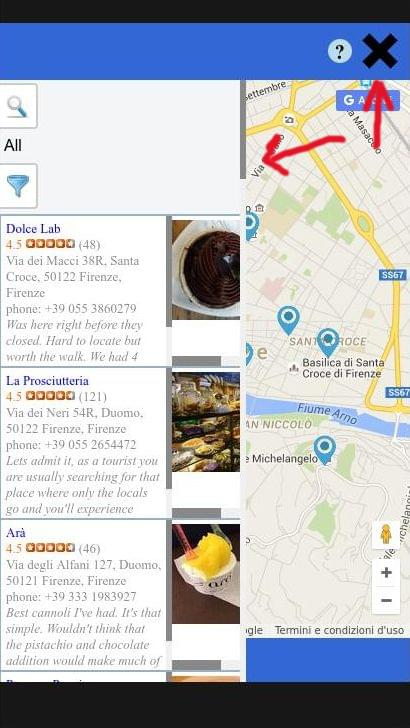
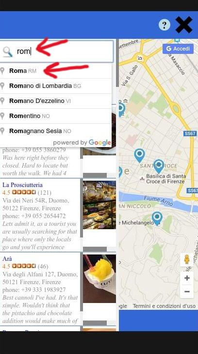

Google Map {Neighborhood Map Project} ver.2.0
===============================
The **Google Map** project starts from a google map request to show the basic google map and gets from [Yelp API](https://www.yelp.com/developers/), [Wikipedia API](https://www.mediawiki.org/wiki/MediaWiki) and [YouTube API](https://developers.google.com/youtube/) informations to add markers to the map and a list of results on the left side panel. At the beginning some places are loaded by default.

Documentation
===============================
To use **Google Map** press on the up right button  to open (and close) the left side panel where to start the search. It's possible to search for e.g. restaurants, bookstores, museum and all the places that have a review on *Yelp* for a chosen city or simple search for a city e.g. london. So the search format are `city name` or `city name, business/tourist place category`. Then press `Enter` to start the search. Below in the panel will appear a list of places matching with the request if there are. With the filter it's possible to filter from the list by name or city. To filter just type the word and the filter start to limit the list results, deleting the word makes to appear back the original list. After having searched or filtered for something if there are changes they are both in the left list and in the markers on the map. Also it's implemented a storage mechanism that allows to close and reopen the browser keeping the list and markers as at the moment of closing (if the broswer memory like cookies, history... is not cleaned). On desktop browser clicking on a list element in the left side panel the map is centered to the related marker (bouncing) and the infowindow is open, going over the element without clicking the marker icon related  gets bigger. Clicking on the marker, in the map, the left panel scrolls to the item related (yellow highlighted) and the infowindow related to this marker appears. Clicking the icon  it opens a window on *how to use* the application (press again on it to close), at the bottom of the window the data sources are mentioned.

Download
===============================
`$ git clone https://github.com/svankj/NeighborhoodMap.git`

Usage
===============================
Launch the web server, or similar, `SimpleHTTPServer` (e.g. `python -m SimpleHTTPServer 8000`) from terminal opened in the directory `NeighborhoodMap/dist/`. In the same directory from another terminal digit `.ngrok http 8000`. Copy the https url generated and paste it in the browser (e.g. `Chrome`).

Dev Tools:
===============================
The projetc has been developed using:
*	*OS Ubuntu 14.04 LTS* (*Trusty Tahr*)
*	Browser *Chromium*/*Chrome*
*	*Sublime Text*
*	*Grunt* to minimize images and JS, HTML, CSS files.
*	*Haroopad* to write the documentation README.md file

External Library:
*	Authentication library: `oauth.js`, `sha1.js`
*	JQuery library: `https://cdnjs.cloudflare.com/ajax/libs/jquery/2.2.3/jquery.min.js`
*	Knockout library: `https://cdnjs.cloudflare.com/ajax/libs/knockout/3.4.0/knockout-min.js`
*	Storage library (Amplify): `https://cdnjs.cloudflare.com/ajax/libs/amplifyjs/1.1.2/amplify.min.js`

Important Warning:
*	**Google Map needs to add in the places indicated in the code the keys, tokens... taken from registration from Yelp and Youtube, so the `app.js` is not minimized because it is where to add this stuff.**

Notes:
*	The storage mechanism it's taken from [here](https://gist.github.com/joeblack3108/24d810b57b7f5b37e21e) I have made some minor modifications to integrate it in my project and I have added a function to storage `observable()`.
*	Yelp is the main source where **Google Map** gets the data of locations, Wikipedia gives the link to the city included in the marker infowindow (press over it to open the Wikipedia web page) and Youtube provides a random link to the city and the business/place included in the marker infowindow (press over it to open the Youtube web page).
*	In the `/src/` directory there is the readable code, in the `/dist/` directory the minimized code.
*	`/src/` contains:
	* 	`css/style.css` the css file readable
	* 	`js/oauth.js` and `js/sha1.js` the authentication JS for Yelp API
	* 	`js/app.js` the application JS readable
	* 	`index.html` the readable HTML file
*	`/dist/` contains:
	*	`css/style.min.css` the minimized css file
	*	`/img/` some images
	*	`js/oauth.min.js` and `js/sha1.min.js` the authentication JS minimized for Yelp API
	*	`js/app.js` the application JS readable (not minimized) because to work needs to add secret token and key
	*	`index.html` the minimized HTML file
	*	`favicon.ico` the favicon
*	`/tool/` contains:
	*	`Gruntfile.js`
	*	`package.json`
*	main directory contains:
	*	`README.md` the README file, documentation file
	*	`/doc/` images for README file
	*	`/dist/` directory
	*	`/src/` directory
	*	`/tool/` directory

Google Map Guide
===============================
 `Screencaps` | `Notes`
--- | ---
 | First to start: the storage mechanism allows to close and reopen the browser with the list elements and related markers at the moment of closure. Even the position open/close of the side panel is restored as it was at the moment of closure. The first time are loaded some default places.
 | Pressing the  button on the right up window shows an information window, plus the data copyright [Yelp API](https://www.yelp.com/developers/), [Wikipedia API](https://www.mediawiki.org/wiki/MediaWiki) and [YouTube API](https://developers.google.com/youtube/).
 | Pressing the  button on the right up window (the icon becomes an X) a side left panel will be opened.
 | **Search feature:** it's possible to choose two ways. One digit at the right of glass icon a name of a city (e.g. `london`). Then press `Enter`.
 | Or more selective way using the format: `name of city` followed by a comma `,` and then a `business place or tourist attraction` (e.g. `london, museum` or `london, bookstore`).  Then press `Enter`.
 | **Filter feature:** just digit in the text at the right of funnel icon a word: a name or a city. The filter will limit the results of list to them matching with the word inserted updating the list and the markers on the map. Deleting the word gets back to the starting list.
 | Pressing an element of list on the left panel will center the map to the related marker. It'll be bouncing and the infowindow related will open.
 | Pressing a marker, vice versa, will open the infowindow and (if the left panel is open) will scroll the left side list to the related element highlighted in yellow color.
 | The infowindow includes some informations, a wikipedia link to the city realted to the marker and a link to a random youtube video related to the city. To close the infowindow just click on the x inside the window.

License
===============================
>MIT License

>Copyright (c) 2016 svankj

>Permission is hereby granted, free of charge, to any person obtaining a copy
of this software and associated documentation files (the "Software"), to deal
in the Software without restriction, including without limitation the rights
to use, copy, modify, merge, publish, distribute, sublicense, and/or sell
copies of the Software, and to permit persons to whom the Software is
furnished to do so, subject to the following conditions:

>The above copyright notice and this permission notice shall be included in all
copies or substantial portions of the Software.

>THE SOFTWARE IS PROVIDED "AS IS", WITHOUT WARRANTY OF ANY KIND, EXPRESS OR
IMPLIED, INCLUDING BUT NOT LIMITED TO THE WARRANTIES OF MERCHANTABILITY,
FITNESS FOR A PARTICULAR PURPOSE AND NONINFRINGEMENT. IN NO EVENT SHALL THE
AUTHORS OR COPYRIGHT HOLDERS BE LIABLE FOR ANY CLAIM, DAMAGES OR OTHER
LIABILITY, WHETHER IN AN ACTION OF CONTRACT, TORT OR OTHERWISE, ARISING FROM,
OUT OF OR IN CONNECTION WITH THE SOFTWARE OR THE USE OR OTHER DEALINGS IN THE
SOFTWARE.

About me
===============================
 | `svanky is a Freelance Developer`
--- | ---
 	|