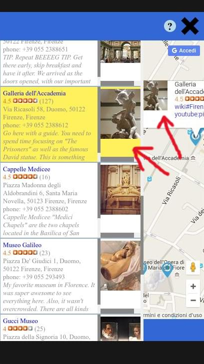

Google Map {Neighborhood Map Project}
===============================
The **Google Map** project starts from a google map request to show the basic google map and gets from [Yelp API](https://www.yelp.com/developers/), [Wikipedia API](https://www.mediawiki.org/wiki/MediaWiki) and [YouTube API](https://developers.google.com/youtube/) informations to add markers to the map and a list of results on the left side panel. At the beginning about ten places are loaded by default.

Documentation
===============================
To use **Google Map** press on the up right button  to open (and close) the left side panel where to start the search. It's possible to search for e.g. restaurants, bookstores, museum and all the places that have a review on *Yelp* for a chosen city. The search format is `city name, business/place category`. Then press `Enter` to start the search. Below in the panel will appear a list of places matching with the request if there are. With the filter it's possible to select from the list a city or a category (taken by Yelp) to limit the results (this is possible only after at least two searches because the terms on the list at the beginning correspond with the elements on the list and select them leaves the list unchanged). After having searched or filtered for something if there are changes they are both in the left list and in the markers on the map. Also it's implemented a storage mechanism that allows to close and reopen the browser keeping the list and markers as at the moment of closing (if the broswer memory like cookies, history... are not cleaned). On desktop browser clicking on a list element in the left side panel the map is centered to the relative marker, going over the element without clicking the marker icon related  gets bigger. Clicking on the marker, in the map, the left panel scrolls to the item related (yellow highlighted), just going over the marker the info-window related to this marker appears and the element related on the left panel gets yellow.

Download
===============================
`$ git clone https://github.com/svankj/NeighborhoodMap.git`

Usage
===============================
Launch the web server, or similar, `SimpleHTTPServer` (e.g. `python -m SimpleHTTPServer 8000`) from terminal opened in the directory `NeighborhoodMap/dist/`. In the same directory from another terminal digit `.ngrok http 8000`. Take the https url generated and digit it in the browser (e.g. `Chrome`).

Dev Tools:
===============================
The projetc has been developed using:
*	OS Ubuntu 14.04 LTS (Trusty Tahr)
*	Browser Chromium/Chrome
*	Sublime Text
*	Grunt to minimize images and JS, HTML, CSS files.
*	haroopad to write the markdown README.md file

External Library:
*	Authentication library: `oauth.js`, `sha1.js`
*	JQuery library: `https://cdnjs.cloudflare.com/ajax/libs/jquery/2.2.3/jquery.min.js`
*	Knockout library: `https://cdnjs.cloudflare.com/ajax/libs/knockout/3.4.0/knockout-min.js`
*	Storage library (Amplify): `https://cdnjs.cloudflare.com/ajax/libs/amplifyjs/1.1.2/amplify.min.js`

Notes:
*	The storage mechanism it's taken from [here](https://gist.github.com/joeblack3108/24d810b57b7f5b37e21e) I have made some minor modifications to integrate it in my project and added a function to storage `observable()`.
*	**Google Map** needs to add in the places indicated in the code the keys, tokens... taken from registration from Yelp, Youtube, Wikipedia, so the `app.js` is not minimized because it is where to add this stuff.
*	Yelp is the main source where **Google Map** gets the data of locations, Wikipedia gives the link to the city included in the marker info-window (press over it to open the Wikipedia web page) and Youtube provides a random link to the city and the business/place included in the marker info-window (press over it to open the Youtube web page).
*	In the `/src/` directory there is the readable code, in the `/dist/` directory the minimized code.
*	`/src/` contains:
	* 	`css/style.css` the css file readable included in index.html to avoid blocking warning
	* 	`js/oauth.js` and `js/sha1.js` the authentication JS for Yelp API
	* 	`index.html` the readable HTML file
*	`/dist/` contains:
	*	`/img/` some images
	*	`js/oauth.min.js` and `js/sha1.min.js` the authentication JS minimized for Yelp API
	*	`js/app.js` the application JS readable (not minimized) because to work needs to add secret token and key
	*	`index.html` the minimized HTML file
	*	`favicon.ico` the favicon
*	main directory contains:
	*	`README.md` the README file, documentation file
	*	`/doc/` images for README file
	*	`/dist/` directory
	*	`/src/` directory

Google Map Guide
===============================
 `Screencaps` | `Notes`
--- | ---
 | At the beginning about ten places are highlighted by a gray area (refreshing the browser makes disappeared the gray area),
 | pressing the  button on the right up window appears on the left a panel where is the list of results with informations and images about the related markers.
 | To search for new locations digit on the right of icon glass the name of city (e.g. rome), followed by a comma `,` and then a kind of business place or tourist attraction (e.g. museum). Then press `Enter`.
 | The filter list appears pressing the funnel icon. Selecting one of the terms e.g. Firenze keeps all the markers of Firenze city and remove everything else.
 | Pressing on one item of the left list the map zooms in the related marker and the marker icon gets bigger.
 | Pressing on one marker on the map makes the list to scroll to the related list element on the left yellow colored.
 | Move over a marker on the map the mouse pointer opens for some seconds the info-windows and the realted item on the left panel gets yellow.

 `Screencaps` | `Notes`
--- | ---
 | When it's clicked one element on the left list, the map goes from wider view including more markers,
 | to the view centered at the related marker of element clicked.
 | Vice-versa clicking on one marker scrolls the left list till reaching the related element and it gets of yellow color.

License
===============================
>MIT License

>Copyright (c) 2016 svankj

>Permission is hereby granted, free of charge, to any person obtaining a copy
of this software and associated documentation files (the "Software"), to deal
in the Software without restriction, including without limitation the rights
to use, copy, modify, merge, publish, distribute, sublicense, and/or sell
copies of the Software, and to permit persons to whom the Software is
furnished to do so, subject to the following conditions:

>The above copyright notice and this permission notice shall be included in all
copies or substantial portions of the Software.

>THE SOFTWARE IS PROVIDED "AS IS", WITHOUT WARRANTY OF ANY KIND, EXPRESS OR
IMPLIED, INCLUDING BUT NOT LIMITED TO THE WARRANTIES OF MERCHANTABILITY,
FITNESS FOR A PARTICULAR PURPOSE AND NONINFRINGEMENT. IN NO EVENT SHALL THE
AUTHORS OR COPYRIGHT HOLDERS BE LIABLE FOR ANY CLAIM, DAMAGES OR OTHER
LIABILITY, WHETHER IN AN ACTION OF CONTRACT, TORT OR OTHERWISE, ARISING FROM,
OUT OF OR IN CONNECTION WITH THE SOFTWARE OR THE USE OR OTHER DEALINGS IN THE
SOFTWARE.

About me
===============================
 | `svanky is a Freelance Developer`
--- | ---
 	|